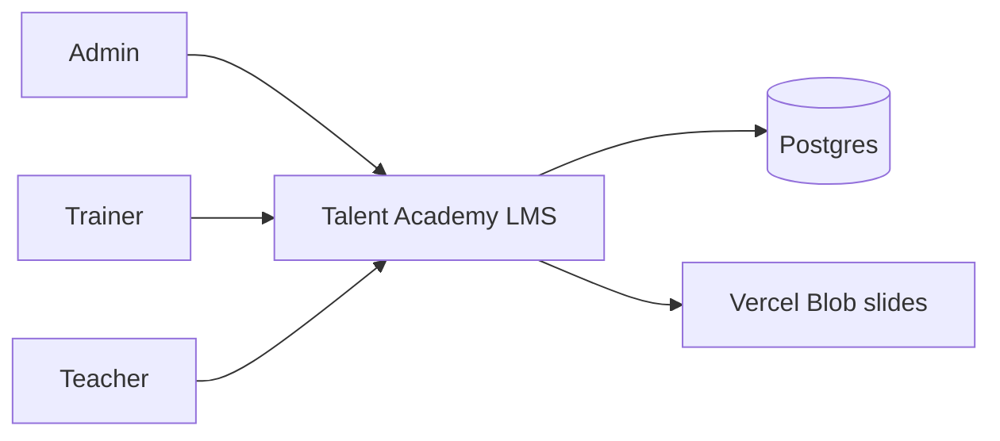
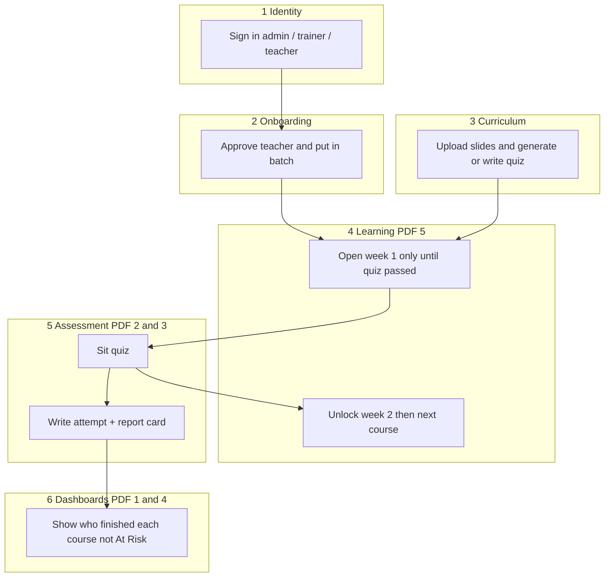
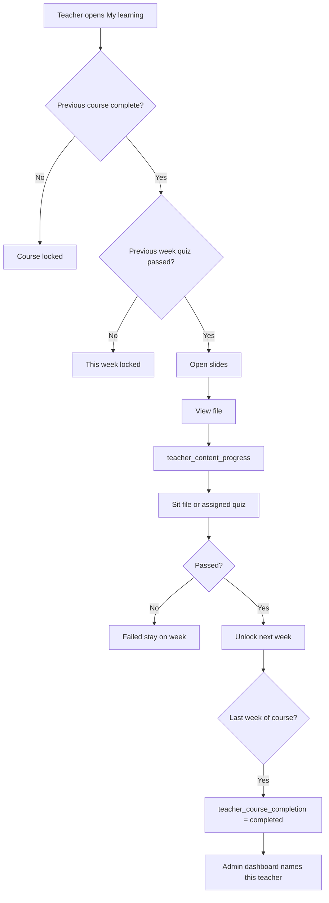

# DFD — how data moves (same system + Taleemabad PDF)

## Context (level 0)

```mermaid
flowchart LR
  Admin[Admin]
  Trainer[Trainer]
  Teacher[Teacher]
  LMS[Talent Academy LMS]
  PG[(Postgres)]
  Blob[Vercel Blob slides]
  Admin --> LMS
  Trainer --> LMS
  Teacher --> LMS
  LMS --> PG
  LMS --> Blob
```

## Level 1 — processes

```mermaid
flowchart TB
  subgraph P1[1 Identity]
    Login[Sign in admin / trainer / teacher]
  end
  subgraph P2[2 Onboarding]
    Enroll[Approve teacher and put in batch]
  end
  subgraph P3[3 Curriculum]
    Upload[Upload slides and generate or write quiz]
  end
  subgraph P4[4 Learning PDF 5]
    Study[Open week 1 only until quiz passed]
    Unlock[Unlock week 2 then next course]
  end
  subgraph P5[5 Assessment PDF 2 and 3]
    Sit[Sit quiz]
    Sync[Write attempt + report card]
  end
  subgraph P6[6 Dashboards PDF 1 and 4]
    Show[Show who finished each course not At Risk]
  end
  Login --> Enroll
  Enroll --> Study
  Upload --> Study
  Study --> Sit
  Sit --> Unlock
  Sit --> Sync
  Sync --> Show
```

## Level 2 — learning unlock (PDF item 5)

```mermaid
flowchart TD
  A[Teacher opens My learning] --> B{Previous course complete?}
  B -->|No| C[Course locked]
  B -->|Yes| D{Previous week quiz passed?}
  D -->|No| E[This week locked]
  D -->|Yes| F[Open slides]
  F --> G[View file]
  G --> H[teacher_content_progress]
  H --> I[Sit file or assigned quiz]
  I --> J{Passed?}
  J -->|No| K[Failed stay on week]
  J -->|Yes| L[Unlock next week]
  L --> M{Last week of course?}
  M -->|Yes| N[teacher_course_completion = completed]
  N --> O[Admin dashboard names this teacher]
```
