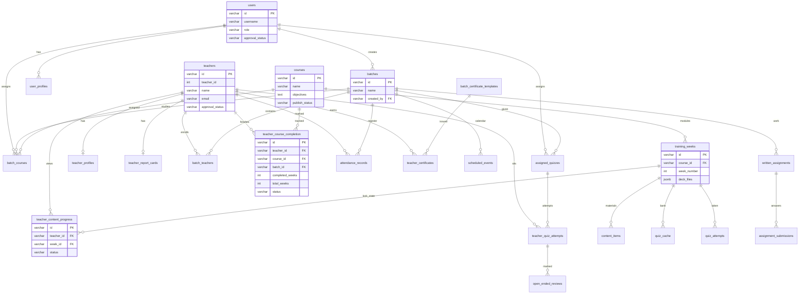

# ERD — Talent Academy database

One Postgres. App tables are `public.*`. Ops labels live in `ops.areas` / `ops.table_map`.

## How it looks in Supabase

| Schema | What you open |
|---|---|
| `public` | Live LMS tables the app reads |
| `ops` | Catalog: area → table → `docs/ops/*.md` |

Areas: **identity → onboarding → learning → classroom → communications → marketing → security**.
