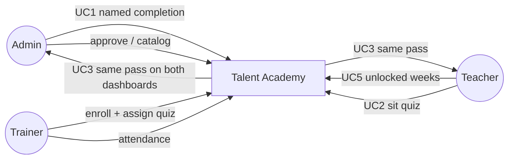

# Use cases

```mermaid
flowchart LR
  Admin((Admin))
  Trainer((Trainer))
  Teacher((Teacher))
  LMS[Talent Academy]

  Admin -->|UC1 named completion| LMS
  Admin -->|approve / catalog| LMS
  Trainer -->|enroll + assign quiz| LMS
  Trainer -->|attendance| LMS
  Teacher -->|UC5 unlocked weeks| LMS
  Teacher -->|UC2 sit quiz| LMS
  LMS -->|UC3 same pass on both dashboards| Admin
  LMS -->|UC3 same pass| Teacher
```
